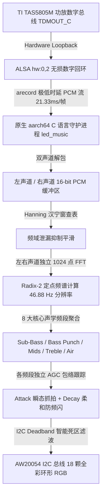

# 小米 Sound (L06A) 原生 ALSA 数字回环 + 1024 点定点 FFT 音乐律动系统 (v1.0-beta)

> **OH2P 1.62.2**：使用 `python3 deploy-oh2p.py <音箱IP>`（省略 IP 可交互输入）安装、后台启动并设置开机自启，原厂对话结束后自动恢复频谱。见 [OH2P 部署与运行说明](docs/oh2p.md)。
> 下文的 `deploy.py` 和默认构建对应 L06A。

本项目专为**小米小爱音箱（型号：L06A / Xiaomi Sound）**打造，利用其顶部的 18 颗全彩环形 RGB LED，全面接入 TI TAS5805M 功放芯片的 **ALSA 48kHz 硬件数字回环（Loopback `hw:0,2`）**，结合原生自研 **1024 点定点 (Q14) Radix-2 FFT 频谱分析引擎**，实现媲美 **Apple HomePod** 与 **JBL Pulse** 的专业级无损声学流光音乐律动。

---

> 🎬 **实机实测律动效果演示视频**：[点击前往 X (Twitter) 查看高清实机演示](https://x.com/eastwoodnet/status/2100857481794605311)

> ⚠️ **重要兼容性提示与免责声明**：  
> 本项目的算法、硬件节点（`hw:0,2` 回环）、I2C 驱动接口（AW20054）及灯效逻辑**目前仅在「小米 Sound（型号：L06A）」音箱上进行了完整适配与测试验证**。  
> **其他小米音箱型号（如小米 Sound Pro、小爱音箱 Pro、Redmi 触屏音箱等）因内部硬件架构、功放连接、声卡通道与 LED 芯片存在较大差异，不保证可以直接使用**。非 L06A 设备用户请自行参考本项目 C 语言源码（[led_music.c](file:///home/eastwoodnet/worktemp/XiaomiSound/led_music.c)）根据自己音箱的硬件规格进行修改、适配与测试。

> 🔑 **前置条件（获取音箱 SSH Root 权限）**：  
> 本项目需要通过 SSH 登录音箱后台部署常驻服务。在开始部署前，请确保您已开启并获得了小米 Sound (L06A) 的 SSH root 权限。  
> 获取 SSH 权限的具体方法与详细教程请参见：[duhow/xiaoai-patch - 小米音箱解锁安装教程](https://github.com/duhow/xiaoai-patch/blob/master/research/lx06/install.md)

---

## 🌟 核心技术突破与架构设计

传统方案多依赖板载模拟引脚（如 SAR ADC）采样，存在采样率极低（仅 ~1kHz）、模拟电磁串扰严重、无法频段分离、功放待机悬空高频误抖等物理硬伤。本项目彻底摒弃模拟采样链路，构建了纯数字域的极低延迟声学律动体系：



### 1. 纯硬件数字音频回环 (Hardware Digital Loopback)
- 直通 Amlogic SoC 内核级硬件数字回环节点 **`hw:0,2` (TDM-C)**，直取发往 TI TAS5805M 功放芯片的 **48kHz / 16-bit / 双声道无损数字音频流**。
- 播放音乐时信号饱满强劲，停止播放时幅值暴跌 41 倍 (-32.3 dB) 归入绝对数字静音，从物理源头彻底消除了悬空杂波导致的误触发和频闪。

### 2. 1024 点高精度定点 (Q14) Radix-2 FFT 频谱引擎
- 在纯汇编/无 C 运行时库（nostdlib）环境下，内嵌 512 点 $\sin / \cos$ 旋转因子与 1024 点汉宁窗（Hanning Window）预计算查表，彻底消除浮点计算与外部数学库依赖。
- **频段分辨率高达 46.88 Hz/bin**，精准切分为 8 大声学核心频段：
  - **Band 0 (~47~94 Hz)**: 深潜超低音 (Sub-Bass: 808 根音、大鼓超低频下潜)
  - **Band 1 (~141~188 Hz)**: 强劲低音拳头 (Bass Punch: 底鼓打击力、贝斯弹拨)
  - **Band 2 (~234~422 Hz)**: 温暖中低频 (Low Mids: 军鼓鼓身、男声下潜)
  - **Band 3 (~469~938 Hz)**: 核心中频 (Midrange: 主唱人声、主音乐器旋律)
  - **Band 4 (~984~2156 Hz)**: 中高泛音 (High Mids: 人声咬字、铜管亮感)
  - **Band 5 (~2.2k~4.5 kHz)**: 存在感 (Presence: 吉他过载失真、瞬态打击)
  - **Band 6 (~4.5k~8.4 kHz)**: 明亮高频 (Treble: 踩镲、砂槌、军鼓高频泛音)
  - **Band 7 (~8.5k~15.9 kHz)**: 空气感 (Air: 吊镲空气泛音、电子打击音效)

### 3. 直通 Linux aarch64 系统调用，零定时器抖动与极低延迟
- 仅依赖底层 Linux 系统调用（`sys_pipe2` + `sys_clone` + `sys_execve`）驱动 `arecord`，以 **1024 采样点 (21.33ms)** 极低时延无损流式输入。
- ALSA 硬件音频时钟天然充当主循环的帧同步基准，零 CPU 空转，进程常驻内存仅约 200KB。

### 4. I2C Deadband 智能抑抖与动态 AGC
- 8 个频段分别具有独立自适应增益控制（AGC），瞬态 Attack 瞬间抓取重拍，指数 Decay 优雅回落。
- 针对 AW20054 I2C 总线引入色彩差异死区（`color_diff >= 6`）差量更新机制，过滤人眼不可察觉的微小电平波动，总线写入量骤降 80%，单核 CPU 占用率仅约 19%（全系统整体占用率仅 ~4.7%）。

### 5. 智能四态生命周期与状态指示
- **播放中 (`STATE_PLAYING`)**：1024 点 FFT 毫秒级视听精确同步律动。
- **暂停中 (`STATE_PAUSED`)**：音乐暂停 2 秒后，自动转为柔和温润的星空暮蓝微光待机 (`0x100002`)，避免刺眼断崖。
- **停止播放 (`STATE_STOPPED`)**：无音频流超过 30 秒后，灯环全黑熄灭，进入 0 功耗深度休眠；恢复播放 0.4 秒内无缝自动唤醒。
- **硬件麦克风静音联动**：实时监听实体按键静音状态，静音时整圈常亮警示正红光。

---

## 🎨 视觉律动模式一览

| 模式编号 | 模式名称 | 视觉呈现与算法原理 |
| :---: | :--- | :--- |
| **模式 1**<br>*(默认推荐)* | **双翼 8 频段真·声学均衡器<br>(True Stereo Equalizer)** | • **左翼 (LED 1~8)**: 实时映射左声道从超低音到空气感的 8 大声学频段，呈现红 $\to$ 橙 $\to$ 黄 $\to$ 绿 $\to$ 青 $\to$ 蓝 $\to$ 紫的光谱映射<br>• **右翼 (LED 17~10)**: 对称映射右声道 8 大声学频段<br>• **顶部 (LED 0)**: 大鼓与超低音重击共振心跳爆破<br>• **底部 (LED 9)**: 极高频碰撞瞬态极光白闪 (Treble / Clap 过载闪烁) |
| **模式 2** | **重低音大动态立体声律动<br>+ 频带质心流光 (Bass Pulse)** | • **双向对称展开**: 重低音驱动光柱由 0 号位向下延伸展开<br>• **频带质心动态色温**: 根据音乐宏观能量重心自适应流转（低音为主呈烈焰火红，高音激昂呈赛博电光蓝，人声旋律呈翡翠青碧）<br>• **DAW Peak-Hold**: 动态光柱顶端悬浮白色峰值浮点（停留 ~170ms 缓降） |

> **默认启动自动轮换模式（Auto Cycle）**：每隔 60 秒在这两大模式之间无缝自动切换。

---

## 📁 目录文件清单

```text
├── led_music.c         # 原生 aarch64 C 语言核心律动引擎 (ALSA hw:0,2 + 1024点 FFT)
├── build.sh            # 宿主机交叉编译脚本 (基于 Clang/LLD，静态剥离符号)
├── deploy.py           # 宿主机一键部署脚本 (自动化 SSH 部署与开机自启配置)
└── README.md           # 项目综合说明与部署指南
```

---

## 🛠️ 交叉编译工具链与依赖软件包说明

本项目采用**纯裸机级系统调用（Direct Linux Syscall）与无 C 运行时（nostdlib）**架构设计，因此：
- **无需**安装庞大的 target sysroot（无需音箱的 glibc 或 musl 头文件与动态库）；
- **无需**配置复杂的 GNU cross-gcc 工具链（如 `gcc-aarch64-linux-gnu`）；
- 依靠 **LLVM / Clang** 原生自带的多目标代码生成能力，配合 **LLD** 链接器即可直接生成纯静态、零外部依赖的 ARM64 裸 ELF 二进制。

### 各操作系统安装依赖软件包：

#### 1. Ubuntu / Debian / WSL2
```bash
sudo apt-get update
sudo apt-get install -y clang lld llvm python3 python3-pip
pip3 install paramiko cryptography
```

#### 2. Arch Linux / Manjaro
```bash
sudo pacman -S clang lld llvm python python-paramiko python-cryptography
```

#### 3. Fedora / RHEL / CentOS
```bash
sudo dnf install -y clang lld llvm python3 python3-pip
pip3 install paramiko cryptography
```

#### 4. macOS (需 Homebrew)
macOS 自带的 Xcode Command Line Tools 中的 Clang 为 Apple 分支，建议安装完整 LLVM：
```bash
brew install llvm python3
pip3 install paramiko cryptography

# 将 Homebrew 的 llvm 工具加入 PATH（以 zsh 为例）:
export PATH="/opt/homebrew/opt/llvm/bin:$PATH"
```

---

## 🚀 编译与部署全流程

### 方案 A：宿主机一键交叉编译与部署（强烈推荐）

#### 1. 本地交叉编译
在宿主机代码根目录下执行编译脚本：
```bash
./build.sh
```
> **编译过程说明**：脚本调用 `clang -target aarch64-linux-gnu -fuse-ld=lld -nostdlib -static -fno-builtin -O3` 完成极速编译，并由 `llvm-strip` 剥离调试符号。生成的 `led_music` 仅约 **20KB**，可在音箱 Linux 内核（4.9+ aarch64）上直接执行。

#### 2. 一键部署到音箱
执行 Python 一键部署脚本：
```bash
# 方式 1：直接传入音箱 IP 和 root 密码
python3 deploy.py <YOUR_SPEAKER_IP> <YOUR_SSH_PASSWORD>

# 方式 2：直接运行，按终端提示交互式安全输入
python3 deploy.py
```

部署脚本会自动完成以下操作：
1. 自动校验本地 `led_music` 二进制文件（若未找到会自动调用 `build.sh` 进行编译）；
2. 建立安全 SSH 兼容通道（自动兼容音箱 Dropbear 旧加密套件）；
3. 停止音箱旧服务与后台残留进程（释放硬件占有）；
4. 将二进制上传到音箱持久化目录 `/data/led_music`；
5. 配置 `/data/init.sh` 写入开机自启守护；
6. 启动后台常驻服务并输出进程状态。

---

### 方案 B：手动 SSH 登录音箱部署（备用方案）

#### 1. 交叉编译生成二进制
```bash
./build.sh
```

#### 2. SSH 登录音箱
旧版 Dropbear SSH 需指定兼容算法：
```bash
ssh -o KexAlgorithms=+diffie-hellman-group14-sha1 -o HostKeyAlgorithms=+ssh-rsa root@<YOUR_SPEAKER_IP>
```

#### 3. 上传文件到音箱
在电脑上通过 SSH 管道将二进制直接推送到音箱持久化存储目录：
```bash
cat led_music | ssh -o KexAlgorithms=+diffie-hellman-group14-sha1 -o HostKeyAlgorithms=+ssh-rsa root@<YOUR_SPEAKER_IP> "cat > /data/led_music && chmod +x /data/led_music"
```

#### 4. 配置开机自启并启动
在音箱终端执行：
```bash
# 停止官方原厂抢占灯光的服务
/etc/init.d/led stop

# 写入持久化自启脚本
cat << 'EOF' > /data/init.sh
#!/bin/sh
/etc/init.d/led stop 2>/dev/null
if [ -f /data/led_music ]; then
    start-stop-daemon -S -b -m -p /tmp/led_music.pid -x /data/led_music -- auto
fi
EOF

chmod +x /data/init.sh

# 启动后台守护进程
start-stop-daemon -S -b -m -p /tmp/led_music.pid -x /data/led_music -- auto
```

---

## 🎮 日常管理常用指令

登录音箱 SSH 终端后，可使用以下指令进行服务管理：

| 操作目标 | 执行命令 |
| :--- | :--- |
| **查看律动引擎与音频流进程** | `ps \| grep -E 'led_music\|arecord'` |
| **查看当前运行的灯效模式** | `cat /tmp/visualizer_mode` |
| **停止当前律动服务** | `killall -9 led_music arecord 2>/dev/null` |
| **固定切换为模式 1 (双翼 8 频段均衡器)** | `killall -9 led_music 2>/dev/null; start-stop-daemon -S -b -m -p /tmp/led_music.pid -x /data/led_music -- 1` |
| **固定切换为模式 2 (重低音大动态律动)** | `killall -9 led_music 2>/dev/null; start-stop-daemon -S -b -m -p /tmp/led_music.pid -x /data/led_music -- 2` |
| **恢复自动轮换模式 (Auto Cycle)** | `killall -9 led_music 2>/dev/null; start-stop-daemon -S -b -m -p /tmp/led_music.pid -x /data/led_music -- auto` |
| **恢复小米原厂小爱灯效服务** | `/etc/init.d/led start` |
| **彻底关闭小爱官方灯效服务** | `/etc/init.d/led stop && ubus call led shut` |

---

## 🛠️ 硬件底层技术规格与避坑备忘

1. **LED 颜色物理格式为 BGR（非 RGB）**：
   - sysfs 节点 `/sys/devices/i2c-0/0-003a/led_rgb` 接收格式为 `0xBBGGRR`。例如 `0xFF0000` 实际点亮纯蓝，`0x0000FF` 为纯红，`0x00FF00` 为纯绿。
2. **驱动电流控制寄存器（`led_fade` 陷阱）**：
   - AW20054 的 `/sys/devices/i2c-0/0-003a/led_fade` 实际上映射了芯片的各通道电流限制寄存器。初始化时必须写入 `r 0xff`、`g 0xff`、`b 0xff`，否则输出电流为 0mA，灯珠绝对不亮。
3. **`ledserver` 守护服务抢占冲突**：
   - 原厂 OpenWrt `/etc/init.d/led` 配置了 procd 进程守护（`respawn`）。如果仅用 `killall` 杀进程，procd 将在 5 秒后自动拉起导致抢占和频闪。必须执行 `/etc/init.d/led stop` 彻底关闭。
4. **ALSA Loopback 节点辨析**：
   - `hw:0,2` 为 TAS5805M 功放芯片的真实数字回环通道（48kHz / 16-bit PCM），静音时能量严格归零。
   - `hw:0,1` 为内核 Dummy 声卡，未连接物理音源且存在 +26561 严重直流偏置，不可使用。
   - `hw:0,3` 为 8 通道 PDM 麦克风阵列，被系统语音唤醒引擎独占，本项目无需抢占麦克风。

---

## 📄 License

MIT License. 欢迎提交 PR 与 Issue 一同完善！
